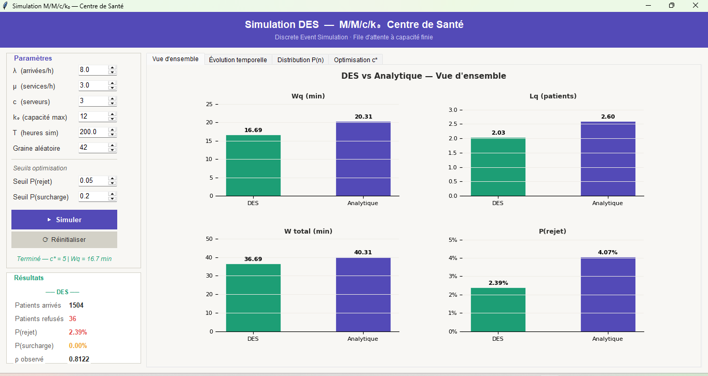
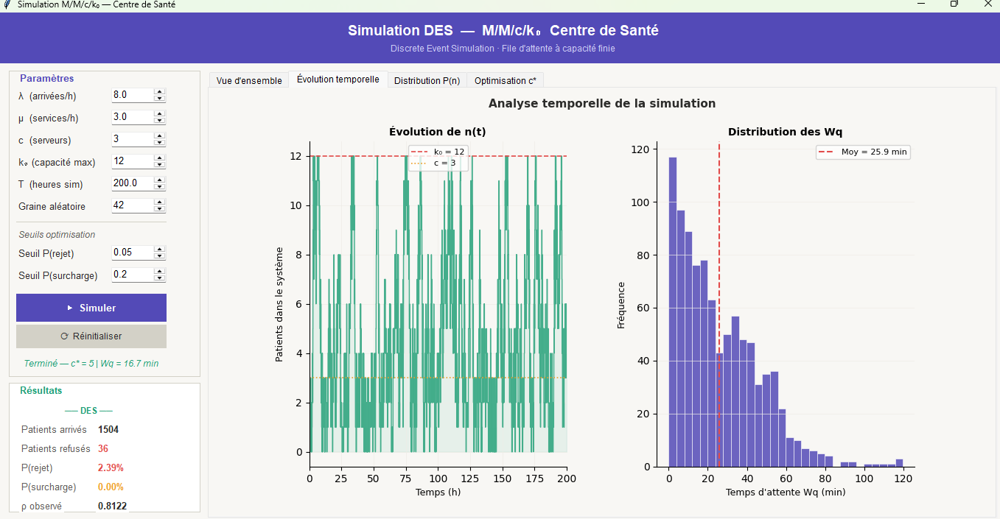
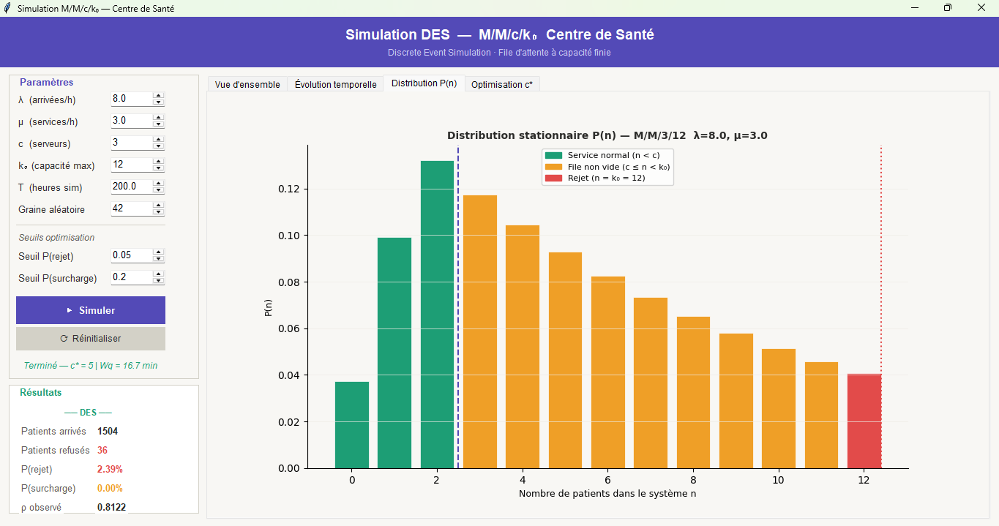
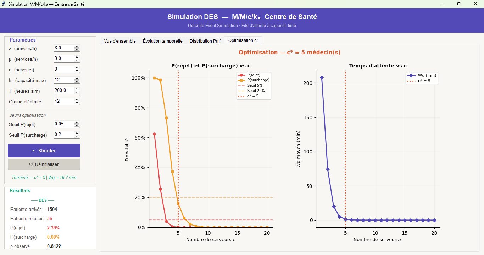

# M/M/c/k₀ Simulation des files d'attente

## Simulation à Evènement Discret pour les centres de santé

[](https://www.python.org/downloads/)
[](https://opensource.org/licenses/MIT)

Un outil professionnel de Simulation à Evènement Discret (DES) pour l'analyse de M/M/c/k₀ des systèmes de file d'attente avec une interface graphique. Parfait pour la planification de la capacité et l'optimisation des centres de santé. 


## Fonctionnalités

- **Simulation à Evènement Discret** de M/M/c/k₀ queues
- **Solution analytique** pour une comparaison en régime stationnaire
- **Optimisation** Pour trouver le nombre optimal de serveurs (c*)
- **Visualisation temps réel** avec matplotlib
- **Une interface utilisateur graphique Professionnelle** conçue avec Tkinter
- **Paramètres configurable** (taux d'arrivée, taux de service, capacité.)
- **Métriques multiples** (Wq, Lq, P(rejet), P(surcharge).)

## Les interfaces





## Installation


```bash
# Cloner le répositori
git clone https://github.com/Arseniki/PatientFlow.git
cd PATIENTFLOW

# Installer les dépendances
pip install -r requirements.txt

# Exécuter l'application
python src/main.py
